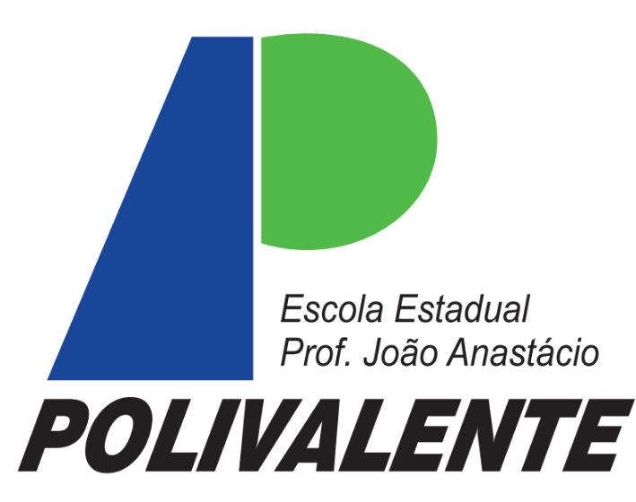

# 📚 Repositório de Aulas - Escola Estadual Prof. João Anastácio (Polivalente)

Bem-vindo ao repositório oficial das minhas aulas na **Escola Estadual Prof. João Anastácio - Polivalente**. Aqui você encontrará materiais, exercícios e conteúdos relacionados às disciplinas ministradas.
 
<a href="https://padisonhogrande.surveycto.com/collect/padi_2025_estudante">Pesquisa</a>
---

## Disciplinas

- [LAB. SOFTWARE](./LAB_SOFTWARE/)
- [G CONT./BD](./G_CONT_BD/)
- [ALGORÍT. ED](./ALGORITMOS/)
- [PROGR. WEB II](./PROG_WEB_II/)
- [LAB. WEB](./LAB_WEB/)
- [P.O.O./JAVA](./POO_JAVA/)
- [FRONT-END I](./FRONT_END_I/)
- [LÓG. DE PROG.](./LOG_DE_PROG/)

---

## 🚀 Como Usar
1. Acesse a disciplina desejada clicando no link correspondente acima.
2. Dentro de cada pasta, você encontrará materiais, exercícios e códigos de exemplo.
3. Fique à vontade para baixar, modificar e estudar o conteúdo.

Caso tenha dúvidas, entre em contato! 😃

---

✍ **Criado por:** *Andersin José Simplício*  

