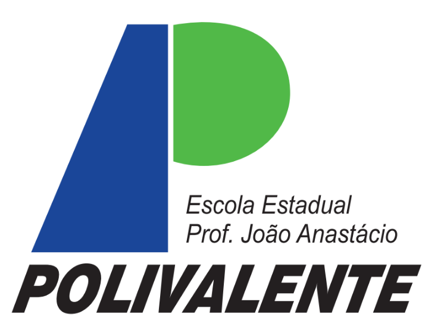

# 📚 Repositório de Aulas - Escola Estadual Prof. João Anastácio (Polivalente)

Bem-vindo ao repositório oficial das minhas aulas na **Escola Estadual Prof. João Anastácio - Polivalente**. Aqui você encontrará materiais, exercícios e conteúdos relacionados às disciplinas ministradas.

---

## Disciplinas

- [P.O.O./KOTLIN](./POO-Kotlin/)
- [P.O.O./JAVA](./POO_JAVA/)
- [LÓG. DE PROG.](./LOG_DE_PROG/)
- [Link para Podcasts das Aulas ](https://drive.google.com/drive/folders/1VV5ItUFHIzWg9wdumv0zIw536j2VD5HQ?usp=drive_link)
---

## 🚀 Como Usar
1. Acesse a disciplina desejada clicando no link correspondente acima.
2. Dentro de cada pasta, você encontrará materiais, exercícios e códigos de exemplo.
3. Fique à vontade para baixar, modificar e estudar o conteúdo.

Caso tenha dúvidas, entre em contato! 😃

---

✍ **Criado por:** *Andersin José Simplício*  

